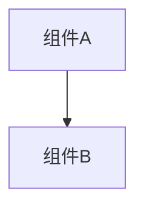

# 变更提案: gptmail

## 元信息
```yaml
类型: 新功能
方案类型: implementation
优先级: P1
状态: ✅已完成
创建: 2026-01-22
```

---

## 1. 需求

### 背景
当前项目自动注册/刷新流程已集成 DuckMail 与 Microsoft 邮箱，但缺少 GPTMail（临时邮箱）支持。用户希望在 fork 仓库中加入 GPTMail 邮箱 API 功能，以便在管理面板中选择 GPTMail 作为验证码邮箱来源。

### 目标
- 增加 GPTMail 邮箱提供商（API Key 模式），可生成邮箱并拉取邮件提取验证码。
- 自动注册流程支持选择 DuckMail/GPTMail。
- 自动刷新流程支持 gptmail 账号（不依赖邮箱密码）。
- 管理面板支持配置 GPTMail Base URL / API Key / SSL 校验。

### 约束条件
```yaml
时间约束: 无
性能约束: 无特殊要求（轮询逻辑沿用现有实现）
兼容性约束: 与现有 DuckMail/Microsoft 逻辑共存
业务约束: 遵循现有项目的“非商业用途”声明与风控提示
```

### 验收标准
- [ ] 后端：`mail_provider=gptmail` 时可生成邮箱并在自动化流程中轮询验证码
- [ ] 后端：刷新流程对 gptmail 账号不再要求 `mail_password`
- [ ] 前端：设置页可配置 GPTMail Base URL / API Key / SSL 校验
- [ ] 前端：添加账号弹窗可选择邮箱服务，并支持导入 `gptmail----email`
- [ ] 测试：`tests/test_gptmail_client.py` 通过

---

## 2. 方案

### 技术方案
新增 `core/gptmail_client.py` 封装 GPTMail API（生成邮箱、拉取邮件、读取详情、提取验证码），并在 `core/register_service.py` / `core/login_service.py` 中按 `mail_provider` 分流。管理面板通过 `GET/PUT /admin/settings` 读写 GPTMail 配置；注册入口 `POST /admin/register/start` 增加 `mail_provider` 参数，前端注册弹窗增加选择项并将该参数透传。

### 影响范围
```yaml
涉及模块:
  - 后端: core/config.py, core/register_service.py, core/login_service.py, main.py
  - 邮箱客户端: core/gptmail_client.py
  - 前端: frontend/src/views/Settings.vue, frontend/src/views/Accounts.vue, frontend/src/api/accounts.ts, frontend/src/types/api.ts, frontend/src/views/Docs.vue
  - 文档: README.md, docs/DISCLAIMER*.md, docs/README_EN.md
预计变更文件: 12+
```

### 风险评估
| 风险 | 等级 | 应对 |
|------|------|------|
| 第三方服务不稳定或限流 | 中 | 复用现有轮询/日志输出，允许通过设置切换服务 |
| API Key 配置错误导致注册/刷新失败 | 中 | 在日志中输出清晰错误；前端提示 GPTMail 需要 API Key |
| 文档与实现不一致 | 低 | 同步 README/免责声明/知识库模块文档 |

---

## 3. 技术设计（可选）

> 涉及架构变更、API设计、数据模型变更时填写

### 架构设计


### API设计
#### POST /admin/register/start
- **请求**: `{ count?: number, domain?: string, mail_provider?: "duckmail"|"gptmail" }`
- **响应**: 注册任务对象（RegisterTask）

### 数据模型
| 字段 | 类型 | 说明 |
|------|------|------|
| {字段} | {类型} | {说明} |

---

## 4. 核心场景

> 执行完成后同步到对应模块文档

### 场景: {场景名称}
**模块**: {所属模块}
**条件**: {前置条件}
**行为**: {操作描述}
**结果**: {预期结果}

---

## 5. 技术决策

> 本方案涉及的技术决策，归档后成为决策的唯一完整记录

### gptmail#D001: {决策标题}
**日期**: 2026-01-22
**状态**: ✅采纳
**背景**: GPTMail API 支持 Header/Query 携带 API Key；项目需要统一配置与低摩擦接入体验。
**选项分析**:
| 选项 | 优点 | 缺点 |
|------|------|------|
| A: 强制要求用户配置 API Key | 行为明确；避免误用测试 Key | 初次上手成本高；注册失败更常见 |
| B: API Key 为空时默认使用 `gpt-test`（推荐） | 上手简单；便于快速验证 | 依赖公开测试 Key，存在外部限流风险 |
**决策**: 选择方案B
**理由**: 面向 fork 用户的快速接入优先；同时保留可配置项用于生产 Key 覆盖。
**影响**: core/gptmail_client.py、core/*_service.py、frontend 设置页与注册流程
